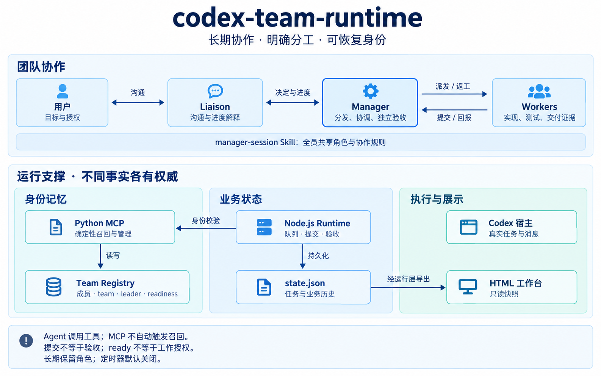
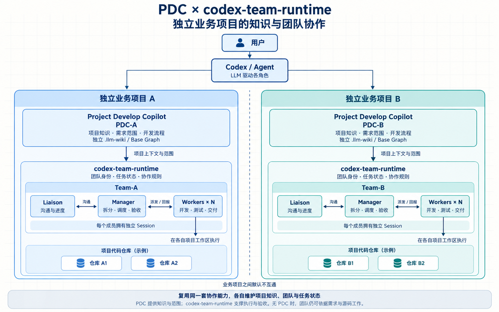

# codex-team-runtime

Skill-driven team coordination for Codex

面向 Codex 长期开发任务的轻量协作层，以 `manager-session` Skill 为入口，将需求沟通、团队协调、执行与独立验收分开，并通过 MCP 恢复长期对话中的团队身份。

**顶级模型把关，合适模型执行；降低协作总成本，不牺牲交付质量。** 当前聚焦 GPT-6 + Codex。成本与质量收益是待对照验证的目标，不是既成承诺；详见 [North Star](NORTHSTAR.md)。

> 长期存在的是身份、状态与协作约定，不是永不停机的 Agent 循环。

## 当前状态

**2026-09-10 架构基线：核心协议已实现，进入真实使用与渐进验证。** 本文包含已在本地安装、尚未全部提交发布的 Registry cutover 增量；不能将架构图或文档提交视为同版本代码已经发布。具体接口以所用 checkout / companion 版本为准。

| 范围 | 已有能力与证据 | 仍需验证或不保证 |
| --- | --- | --- |
| 业务运行层 | 持久轮次/任务、FIFO 队列、占用保护、提交与独立验收、投递恢复 | 不保证原生消息恰好一次送达，不支持已启动任务的强制抢占与重新分配 |
| 长期角色记忆 | Python MCP + Team Registry；全员精确身份召回、Manager 登记与回执确认 | MCP 不主动触发；跨月、多次自然压缩后的召回率仍待验证 |
| Registry 运行接入 | 本地 cutover 增量连接当前身份与 Node 业务状态，保留历史；一键升级团队两名正式成员已迁入并本人确认 | 不自动迁入其他团队，不代表所有窗口已加载新版；新版真实 Worker 完整闭环仍需测试 |
| HTML 工作台 | 本机只读最新入口按页面请求同步 Node + Registry；保留离线快照、筛选、轮次、成员与证据 | 不派工、不唤醒 Agent；不是原生实时遥测，未自动采集 Token/费用 |
| 监督与汇报 | Worker 通知、前台有界检查、汇报操作账本；旧版已有现场闭环证据 | 非常驻调度器；无人值守停报、自动收件箱及强制到期宿主接入尚未完整交付 |

本地安装、MCP 连接加载、成员本人恢复和自然召回成功是不同结果，不能相互替代。阶段性验证见下文，不能将旧版本测试直接当作新版全链路通过。

## 总体架构



图为当前设计概览，分组表示职责而非部署机器；连线不构成完整执行时序。用户仍可直接与 Manager 或 Worker 沟通。Node 的身份校验通过 Python 只读 exporter 完成；state 到 HTML 表示经运行层读取并派生视图，可用于离线导出或最新工作台。

| 层 | 组成 | 职责 |
| --- | --- | --- |
| 协作契约 | `manager-session` Skill / references | 全员召回、角色边界、委派、占用保护、回报与验收约定 |
| 身份与角色记忆 | Python Team Context MCP / Team Registry | 确定性身份访问、正式名册、精确 leader、规则版本、入队确认 |
| 业务运行层 | Node.js CLI / 状态机 / `state.json` | 轮次、任务、队列、提交、验收、历史与审计 |
| 宿主执行与展示 | Codex 原生工具 / 派生 HTML | 宿主执行真实任务与消息操作；页面只读展示 |

**模型负责判断，代码负责校验已编码的不变量，宿主负责真实动作。**

已链接团队的当前身份以 Registry 为权威；Node 维护业务历史并读取经校验的成员投影。宿主实际状态以原生工具证据为准，HTML 不拥有第二份可写状态。裸 `state.json` 内的成员缓存不一定是最新身份，应通过正式读取入口查询。

详细说明：[总体架构设计](docs/design/manager-session-runtime-architecture.md) · [长期角色记忆与召回](docs/design/long-term-role-memory-and-recall.md)。

## PDC 与团队协作场景



这张图描述 PDC 与 `codex-team-runtime` 的实际组合场景，不是必须依次调用的处理流水线，也不新增跨团队 Manager。

- **PDC 提供项目知识与范围**：独立业务项目 A、B 分别维护自己的 `.llm-wiki` 与项目图谱，默认不互读、不互写；单个业务项目内部可以包含多个代码仓库。
- **Team 负责执行与验收**：各自的 Manager 根据项目证据拆分任务，安排 Worker 到对应工作区开发；Liaison 负责沟通与进度解释。初始一个 Worker 是最小配置，不是数量上限。
- **复用能力，不混合状态**：两边使用同一套协作软件，但按 `teamId` 维护各自的身份和任务，互不接管调度与验收。这是工作流边界，不代表操作系统或文件访问权限的安全隔离。
- **PDC 是可选增强**：没有 PDC / Base Graph 时，团队仍能依据需求、文档和源码完成拆分、开发与验收，不要求先安装 PDC 或初始化 Wiki。

具体规则见 [项目感知分派与可选 PDC 集成](skills/manager-session/references/project-dispatch.md)。

## 角色分工

| 角色 | 主要职责 | 边界 |
| --- | --- | --- |
| 用户 | 目标、范围、重大取舍、授权与必要的人工作业验收 | 可直接进入成员任务交流；直接消息仍可能干扰正在执行的工作 |
| Manager | 需求确认、拆解派发、成员登记、协调、监督、返工与独立验收 | 默认委派实现；不能代 Worker submit，不把完成声明当作已验收 |
| Liaison | 日常沟通、只读进度解释、问题讨论、转交已确认决定 | 不派工、不指挥 Worker、不代验收；工作关闭后停止普通进度汇报 |
| Worker | 在明确范围与文件所有权内实现、测试、构建或部署，提供证据并回报 | 不扩大授权，不自行更换 leader，交付前恢复自身团队身份 |
| 临时 Subagent | 有界探索、实现或审查辅助 | 不因继承上下文成为正式成员，不冒用父任务身份 |

典型沟通关系是“用户 ↔ Liaison ↔ Manager ↔ Workers”，不是强制消息总线。拆分窗口旨在减少干扰，不保证所有交互绝不打断。“已转交”“已收到”“已执行”必须分别核对；Liaison 到 Manager 的持久命令收件箱尚未实现。

## 长期角色记忆与召回

Skill 是按需加载的规则，不是持久数据库。MCP 提供独立记忆入口，确定性 Python 代码维护 Team Registry，不调用 LLM，不依赖 AGC、hook 或定时轮询。

`team_context.read({host_id, thread_id})` 按**当前独立任务经核对的精确身份**返回自己、team、leader、版本化职责和入队状态。active Manager 额外获得正式名册；已链接团队还能恢复原 state、runtime 与 Python 定位。

- `active`：恢复角色，随后核对接入、当前工作与授权；不代表宿主在线或空闲。
- `null`：未登记，不自动注册；普通工作照常，已知团队先找回原定位。
- `inactive`：已退出，不从旧摘要重新恢复角色。
- 错误或不可用：暂停受影响的角色操作，不当作 null，不创建空表或绕回旧身份权威。

**全员使用同一契约**：首次入队、前台续接或上下文丢失、身份/规则冲突，以及交付、接收、验收前进行召回；其他协调动作在上下文缺失或过时时恢复。不在每次文件读写前重复调用。

角色记忆不等于任务记忆：先恢复“我是谁、向谁负责”，再从原业务状态和 brief 恢复“当前获授权做什么”。工具描述可能仍进入其他对话目录，未登记返回 null 不等于零 prompt 开销。

> 持久记忆可恢复，不等于 Agent 必然主动想起。当前没有强制注入或自动触发保证，自然召回率是下一阶段的重点指标。

## 成员登记与业务准入

1. 用户授权启用团队或加入正式成员，Manager 核对原生 host/thread 身份与授权。
2. Manager 维护团队及成员登记；Worker/Liaison 不自行注册或选择 leader，Liaison 还需本人同意。
3. 每位成员在自己的任务加载共同规则并 read，回传 `onboardingReceipt` 和职责理解。
4. Manager 核对真实回复来源并 `confirm_ready`；Manager 自己也需本人 read/确认。
5. 复读当前状态，再检查工作授权、成员占用、FIFO、宿主状态和投递条件。

**registered ≠ ready ≠ 工作授权。** 回执不是身份认证、理解能力或未来召回证明；`dispatchAllowed=false` 表示 context read 不授予或执行派工，并不需要将它改为 true。

未链接团队为 `not-connected`，只提供身份上下文；已链接为 `connected`，仍需通过业务准入；`migration-pending` 阻止普通业务操作。新成员不会自动加入旧轮次。

## 任务闭环与忙碌保护

主路径是 `queued → executing → submitted → reviewing → approved`。审查可进入 `rework → submitted`；仅未启动的 queued 任务可以明确取消为 `cancelled`。执行、提交、审查和返工阶段可阻塞，恢复遵循原状态记录。

- Worker 本人持久化 submit 后，准备并核对通知，再通过获授权的原生消息向精确 Manager 回报。
- Manager 接收提交并核对实际证据，独立验收或要求返工。通知准备不等于已发送，原生最终回答不等于已验收。
- 未验收任务持续占用 Worker。独立新需求进入 Manager 侧持久 FIFO 队列，不发送“做完后顺便做任务2”来代替排队。
- 原生 idle、相同技术领域或紧急程度都不自动释放占用；当前任务的窄范围澄清与返工不等于独立新需求。
- 投递结果 unknown 时保留占用并对账。只有确认未送达且不会迟到，才能领取新的发送尝试；不盲重发、不换 ID 绕过。

完成轮次不退出长期角色；角色退出也不等于停止、取消或归档原生 Worker。详见 [运行层接口](docs/runtime-usage.md)、[投递恢复契约](skills/manager-session/references/delivery-recovery.md)。

## 监督与汇报：默认无定时器

默认推进来自 Worker 完成/阻塞通知、用户主动续接与查询。Manager 进行前台有界检查，Liaison 从可信快照解释进度，不为每次询问唤醒团队。消息失败或 Manager 未被唤醒时，当前系统不能保证自动恢复。

定时器默认关闭；启用必须由人确认固定窗口，**最多24小时，续期再次确认**。没有已验证的宿主到期停止能力时不启用。新任务、新轮次、角色恢复或“继续”都不自动恢复定时器。5/15分钟仅是获授权后可选节奏。

相关工作关闭后停止普通进度汇报，保留历史问答与角色；停止汇报、静音、角色退出和取消执行是不同操作。[汇报账本](docs/reporting-usage.md) 记录操作及未知结果，不等于真实调度器或原生送达证据。

## 模型策略与 Skill 组合

- Manager 的模型与强度由用户指定，保留用户配置。
- 新正式 Liaison/Worker 默认 Sol / medium；临时 Subagent 默认 Sol / medium 或适合的 Terra/Luna，不超过直接父 Agent 的模型等级。复用成员不擅自改模型。
- 模型策略是 Skill 约定，由宿主执行，不是 Node 强制校验器或性能保证。
- 同一受管工作只有一个调度与最终验收所有者。PDC 可提供项目知识与阶段方法，不隐式接管既有团队。
- `task-dispatch` 保留投递即止语义；`project-task-dispatch` 有自己的控制状态。本契约下需用户明确选择，遇到已有所有者先确认非重叠范围或交接。
- 本项目不依赖修改其他 Skill，不保证外部 Skill 自动遵守契约，也未实现跨运行层自动迁移。

成员命名采用 `角色-项目简称-任务主题`；长期 Manager/Liaison 可省略主题。名称帮助识别，不能代替精确 host/thread 绑定。

## 使用与升级

需要可信运行代码与 Node.js 22+；MCP 需要 Python 3.10+ 及官方 MCP Python SDK。单独复制 Skill 不会携带运行层。

先体验不接入真实团队的离线演示：

```text
node src/cli.mjs demo artifacts/demo
```

输出目录必须是新目录，示例明确标记模拟来源，不连接真实任务或自动化。已有可信状态可导出只读工作台：

```text
node src/cli.mjs dashboard <state.json> <新输出目录> [asOf] [--codex-links]
```

需要随记录更新的固定运行入口：

```text
node src/cli.mjs dashboard-serve <state.json> [--port <0..65535>] [--codex-links]
```

打开返回的完整启动链接，页面可见时每 5 秒检查，隐藏 / 暂停 / 关闭后停止请求。服务只监听本机，Ctrl+C 停止；不启用 Agent 定时器、不消耗 Agent Token。Registry 链接团队需配置匹配的 Python 读取环境。旧静态页面不会自行变成最新页；职责、凭据与停止方法见 [最新工作台与历史快照](docs/live-dashboard.md)。

单页可用 `snapshot <state.json> <新输出目录> [asOf] [roundId]`。工作台支持总览、历史轮次、任务筛选、成员、历时与证据展开；对话链接需显式启用，仅为本机兼容入口，不保证跨主机定位。历时包含排队、等待与审查，不等于模型计算耗时。

团队接入从 [manager-session Skill](skills/manager-session/SKILL.md) 和 [MCP 使用说明](docs/team-context.md) 开始。读取 Skill 不激活角色，不授权安装、创建任务或定时器。

长期使用应安装稳定、同版本的非 editable Python 环境、Node companion 与 Skill，将 Registry/state 与代码分开。更新保留原数据路径，不复制第二份团队；安装完成后仍需逐任务确认 MCP 已加载新版。

旧团队由**原 Manager 获授权后显式迁入**，保留正式名册、备份与业务历史，迁入后全员本人重新确认。不自动扫描历史协作者、恢复旧任务或启动定时器。未链接 legacy 的 `start/attach/resume` 仍有其限定用途；不能用旧身份写入绕过已链接 Registry 的错误。

## 验证证据与下一步

以下为架构基线记录的历史证据，不是长期效果保证；最新工作台的隔离测试方法与范围另见 [使用说明](docs/live-dashboard.md#开发验收)，不冒充真实团队迁入或成员交付证据：

| 证据 | 范围 |
| --- | --- |
| 本地 cutover 基线：Python 133项、Node 项目196项及相关修复回归 | 隔离协议/集成、独立审查与修复回归；详细本地记录尚未随文档提交发布 |
| 一键升级团队迁入：两名正式成员 ready | 原 Manager 与 Liaison 本人引导恢复；没有登记历史 Worker、恢复旧任务或启用定时器 |
| [Registry 基础层验证](docs/team-registry-validation.md) / [旧 locator 验证](docs/team-context-validation.md) | 早期身份层与定位协议证据 |
| [提交通知现场闭环](docs/submission-evidence.md) | 旧版真实消息、审查、返工、复验与收口；不是新版全链路保证 |
| [忙碌与 FIFO 验证](docs/busy-worker-evidence.md) / [投递恢复实测](docs/delivery-canary-evidence.md) | 占用、排队、取消与受控跨回合投递恢复 |
| [HTML 验收记录](docs/dashboard-validation.md) | 看板筛选、展开、窄屏、键盘与成员入口；[导航限制](docs/design/codex-navigation.md) 仍适用 |

开发者可执行 `node --experimental-test-isolation=none --test`；Python 测试按 MCP 文档配置独立环境。

下一阶段以真实任务的小步验证为主：

1. 新版链接团队的 Worker 新任务 → 回报 → 返工 → 独立验收完整闭环。
2. 不提示工具名时，重启、闲置、压缩和规则更新后的自然召回率、职责执行与人工纠偏。
3. 在相同质量门槛下比较团队总 Token/费用，记录无效召回及对无关对话的干扰。
4. 改善旧 MCP 连接识别与版本可观测性；只有确需定时能力时再完善宿主接入。

不承诺永不遗忘、无限自治、强身份认证、跨主机锁、全局原子事务或固定 Token 节省比例。

## 文档

- [总体架构设计](docs/design/manager-session-runtime-architecture.md)：分层、权威、全员召回、任务闭环、迁入与安全边界。
- [长期角色记忆与召回](docs/design/long-term-role-memory-and-recall.md)：问题、MCP 选择、恢复节点与自然召回验证。
- [运行层使用说明](docs/runtime-usage.md) / [MCP 接口](docs/team-context.md) / [汇报账本](docs/reporting-usage.md)。
- [只读工作台设计](docs/design/dashboard.md)。
- [原始设计草案](docs/design/manager-session.md) / [V1 范围与验证门槛](docs/v1-scope.md)：保留阶段性设计与验收上下文。
- 本地 cutover 补充材料：`docs/team-registry-cutover.md`、`docs/team-registry-cutover-validation.md`；尚未随本次文档提交发布。

## License

[MIT](LICENSE)
